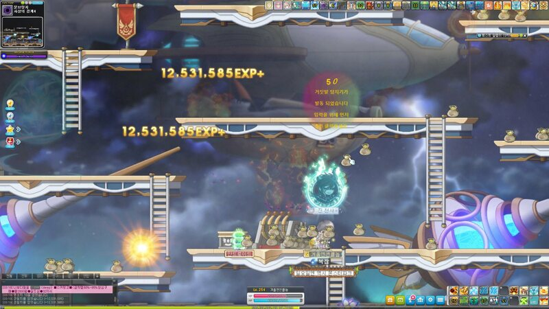
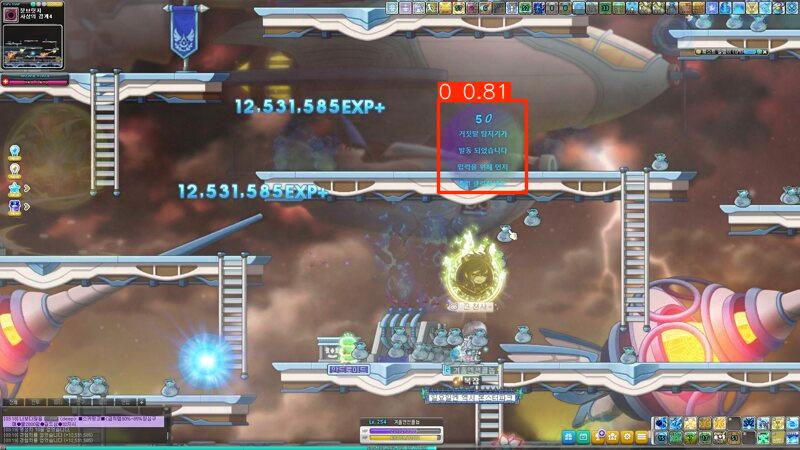

# YOLOv8 Custom Model - [MapleStory Lie Detector Detector]

### Responsible Use

While this project demonstrates powerful machine learning techniques, it is important to note that these tools should be used responsibly. We strongly discourage any use of this project or its derivatives for illegal, unethical, or harmful activities. The authors and contributors of this project do not condone or support the use of this code for:

- Unauthorized use as a "third-party program" or "unauthorized software" as defined by Nexon
- Creating or distributing cheats, bots, or any form of automation for games.

### Educational Purpose

Our primary goal with this project is to provide a learning resource for those interested in machine learning and computer vision. The knowledge gained from this project should be applied in a manner that is positive, constructive, and in line with legal and ethical standards.


### 책임사용

이 프로젝트는 강력한 기계 학습 기술을 보여주지만, 이러한 도구는 책임감 있게 사용되어야 한다는 점에 유의해야 합니다. 당사는 불법적, 비윤리적 또는 유해한 활동을 위해 이 프로젝트 또는 그 파생물을 사용하는 것을 강력히 금지합니다. 이 프로젝트의 저자 및 기여자는 다음과 같은 이유로 이 코드를 사용하는 것을 묵인하거나 지지하지 않습니다:

- 넥슨이 정의한 '제3자 프로그램' 또는 '비인가 소프트웨어'로 무단 사용
- 게임을 위한 치트, 봇 또는 모든 형태의 자동화를 만들거나 배포합니다.

### 교육목적

이 프로젝트는 기계 학습과 컴퓨터 비전에 관심이 있는 사람들을 위한 학습 자원을 제공하는 것을 주된 목표로 한다. 이 프로젝트를 통해 얻은 지식은 긍정적이고 건설적이며 법적, 윤리적 기준에 부합하는 방식으로 적용되어야 한다.

## Introduction
This project is a custom YOLOv8 model trained to detect [MapleStory Lie Detector Image Detection]. The model has been trained using a dataset containing [1903 Lie Detector Images] and is capable of accurately identifying [the clickable lie detector] in images.

## Model Details

- **Model Type**: YOLOv8
- **Training Dataset**: https://universe.roboflow.com/andy-de-gheldere-fmqy2/ldldldld/dataset/2
- **Number of Classes**: [6]
- **Classes**: 
  - 0: ['0']
  - 1: ['1']
  - 2: ['captcha']
  - 3: ['color']
  - 4: ['origin']
  - 5: ['star']
- **Training Epochs**: [100]
- **Image Size**: [640x640]
- **Learning Rate**: [Default]
- **Best Model**: [runs/detect/train8/weights/best.pt]

## Installation

To use this project, you need to have Python and the required dependencies installed. You can follow these steps:

1. **Clone the Repository**:
    ```bash
    git clone https://github.com/jaeyoon492/lie-detect-yolo.git
    cd lie-detect-yolo
    ```

2. **Install Dependencies**:
    Install the required Python packages using pip:
    ```bash
    pip install -r requirements.txt
    ```

    Alternatively, you can install the necessary packages manually:
    ```bash
    pip install ultralytics opencv-python matplotlib
    ```


## Usage

### 1. Running Inference

To run inference using the trained model, use the following script:

```python
from ultralytics import YOLO
import cv2
import matplotlib.pyplot as plt

# Load the trained model
model = YOLO("path/to/your/trained_model.pt")

# Load and preprocess the image
image_path = "path/to/your/image.jpg"
image = cv2.imread(image_path)

# Run inference
confidence_threshold = 0.5
results = model.predict(source=image, imgsz=640, conf=confidence_threshold)

# Display the results
results.show()
```

## Troubleshooting CUDA Issues

If you encounter issues related to CUDA while running the model, such as errors related to CUDA backend or the model not utilizing the GPU, it might be due to an incorrect installation of PyTorch and its dependencies. Here’s how you can troubleshoot and resolve these issues.

### 1. Check PyTorch and CUDA Compatibility

First, verify that your PyTorch installation is configured to use CUDA:

```python
import torch

print("CUDA available:", torch.cuda.is_available())
```

### 2. Installing the Correct Version of PyTorch

Uninstall the current PyTorch version:
```bash
pip uninstall torch torchvision torchaudio
```

Reinstall PyTorch with the appropriate CUDA version:

You can install the correct version of PyTorch by specifying the CUDA version. For example, if you have CUDA 12.5 installed, use the following command:

```bash
    pip install torch torchvision torchaudio --index-url https://download.pytorch.org/whl/cu124
```

### 3. Verifying the Installation

```python
import torch

print("CUDA version:", torch.version.cuda)
print("CUDA available:", torch.cuda.is_available())
print("GPU available:", torch.cuda.device_count())
```

### 4. Common Issues and Solutions
CUDA Not Found Error: Ensure that the CUDA toolkit and drivers are properly installed on your system. You can check your CUDA installation by running:
```bash
nvcc --version
```

### 5. Fallback to CPU
If you are unable to resolve CUDA-related issues, or if you are working in an environment without GPU access, you can modify the code to run on the CPU:

```pycon
device = torch.device('cpu')
model = YOLO("path/to/your/trained_model.pt", device=device)

# Run inference on the CPU
results = model.predict(source=image, imgsz=640, conf=0.5)
```

### Test Image Example


### Result Image Example
